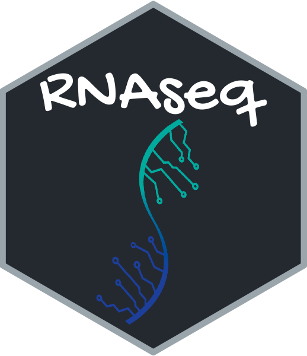

# Pipeline of transcriptome data analysis

## Overview

This workshop recorded the whole processing steps of transcriptome data analysis in CC-LY Lab written by Shawn (Xiangyu) Pan and Xuelan Chen. This page would be helpful and easy to be read and operated, especially for the bioinformatic new-hand. We will try to keep updating of ` Pipeline-of-transcriptome`. And this pipeline is flexible, you could broaden more analysis steps and tools in tegrated into this page, such as GSEA analysis, TF enrichment, bulk RNA-seq data deconvolution and et al. We also expected you could add comments and provide request to improve this page. Hope you could had a good grip of the basic transcriptome data analysis rapidly and smoothly

## **The analysis pipeline included**

- [x] Alignment
- [x] Transcription quantification
  - [x] `GenomicsFeatures` and `Rsamtools`
  - [x] `Stringtie`
  - [x] `RSEM`
- [x] DEG identification
  - [x] The summary of the methods to calculate the p-value
- [x] GO/KEGG enrichment
- [x] GSEA
- [x] Alternative splicing
- [ ] Motif/TF identification
- [ ] RNA editing
- [ ] Mutation
- [ ] et al.

## 1. The pre-processing steps

In this page, ```GenomicAlignments``` and ```Rsamtools``` were used to quantify the counts of transcriptome  data. In old version, we used FPKM and TPM for heatmap visualization and gene set enrichment analysis, however, in latest version,  DESeq2 normalized data , which was much better to reduce the effect of gene body and library size, were used to describe the expression pattern of each gene. And the pathways enrichment also based on the DESeq2 normalized data, especially for GSEA processing. 

Here, ```DESeq2 pipeline``` also was used to identify the differentiated expressed genes. There were some essential parameters to set the cutoff of DEG detecting in this pipeline. The detail information would be explained in following pages. To direct visualize the DEGs' function, ```clusterprofiler``` was implemented in this pipeline. GO/KEGG database could be enriched by DEGs with default parameter.  Besides, we also integrated the GSEA processing in following page.

- Before, we used this pipeline, there were some softwares should be installed: 

~~~shell
#STAR
STAR_2.6.0a

#Rscript
R scripting front-end version 3.5.1 (2018-07-02)
~~~

- Then, you could begin the learning of [The alignment of bulk RNA-seq](step1.md)

## 2. The post-processing steps

After you running out the ` pre-processing steps`, you could directly begin [The quantification of genes and the identification of DEG.](step2.md) You could could visit the page by clinking [here.](step2.md)

## 3. The optional methods  in transcripts quantification and p-value calculation

## 3.1 The summary of quantification of transcripts methods  

- And sometimes, you want to quantify the expression levels of each transcripts in bulk RNA-seq, I suggest you follow next pipeline, quantified by ``stringtie`` and/or `RSEM`. 

  [Part 1. The quantification of transcripts by stringtie ](step3.md)

  [Part 2. The quantification of transcripts by RSEM](step4.md)

## 3.2 The summary of some statistic methods

- When we compared the expression levels of candidate gene in different biology group, statistic power is so important that could determine the confidence of the results. To better support our hypothesis of candidate genes, especially doing analysis in multiple clinical cohorts, we could refer to more methods of p-value calculation. 
- [Here](pvalue_cal.md), I had generated a[summary of the methods to calculate the p-value](pvalue_cal.md) in DEG identification. And you also could visit them by clicking [here](pvalue_cal.md)

## 4. The identification of alternative splicing events

- After you learn all the steps mentioned above, you could begin the learning of [The identification of alternative splicing events](AS_identified.md)

## 5. Keep updating


