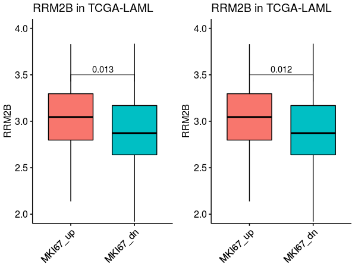

# the summary of the methods to calculate the p-value in DEG identification

## 1. Import the test data as example.

~~~R
all_merge_test <- mcreadRDS("/mnt/data/user_data/xiangyu/workshop/DATABASE/All_pvalue_calculate_test_data.rds")
p1 <- ggboxplot(all_merge_test, x = "new_group", y = "RRM2B", fill="new_group",
  title="RRM2B in TCGA-LAML", legend = "none",outlier.shape = NA,ylim=c(2,4),notch = FALSE) +
  rotate_x_text(angle = 45)+ 
  stat_compare_means(comparisons =list(c("MKI67_up","MKI67_dn")), method = "wilcox.test",label.y=3.5)  
p2 <- ggboxplot(all_merge_test, x = "new_group", y = "RRM2B", fill="new_group",
  title="RRM2B in TCGA-LAML", legend = "none",outlier.shape = NA,ylim=c(2,4),notch = FALSE) +
  rotate_x_text(angle = 45)+ 
  stat_compare_means(comparisons =list(c("MKI67_up","MKI67_dn")), method = "t.test",label.y=3.5)  
plot_grid(p1,p2)
~~~

## 2. t.test/wilcox.test (classical)

~~~R
t.test(subset(all_merge_test,new_group=="MKI67_up")$RRM2B,subset(all_merge_test,new_group=="MKI67_dn")$RRM2B,paired=FALSE)$p.value
[1] 0.01186587
wilcox.test(subset(all_merge_test,new_group=="MKI67_up")$RRM2B,subset(all_merge_test,new_group=="MKI67_dn")$RRM2B,paired=FALSE)$p.value
[1] 0.01311382
~~~

## 3. based on binomial of anova (classical)

~~~R
all_merge_test$y <- all_merge_test$new_group=="MKI67_up"
bino_model <- glm(all_merge_test$y ~ all_merge_test$RRM2B, family="binomial")
anova(bino_model, test="F")$"Pr(>F)"[2]
[1] 0.01087381
Warning message:
In anova.glm(bino_model, test = "F") :
  using F test with a 'binomial' family is inappropriate
anova(bino_model, test="Rao")$"Pr(>Chi)"[2]
[1] 0.01201845
anova(bino_model, test="LRT")$"Pr(>Chi)"[2]
[1] 0.01087381
anova(bino_model, test="Chisq")$"Pr(>Chi)"[2]
[1] 0.01087381
~~~

## 4. DESeq2 p value (wald.test)

~~~R
all_merge_test$y <- all_merge_test$new_group=="MKI67_up"
wald_model <- glm(y ~ RRM2B, data = all_merge_test, family="binomial")
summary(wald_model)

Call:
glm(formula = y ~ RRM2B, family = "binomial", data = all_merge_test)
Deviance Residuals:
     Min        1Q    Median        3Q       Max
-1.70466  -1.13642   0.00887   1.13895   1.55108
Coefficients:
            Estimate Std. Error z value Pr(>|z|)
(Intercept)  -3.0383     1.2549  -2.421   0.0155 *
RRM2B         1.0255     0.4195   2.444   0.0145 *
---
Signif. codes:  0 '***' 0.001 '**' 0.01 '*' 0.05 '.' 0.1 ' ' 1
(Dispersion parameter for binomial family taken to be 1)
    Null deviance: 196.85  on 141  degrees of freedom
Residual deviance: 190.37  on 140  degrees of freedom
AIC: 194.37
Number of Fisher Scoring iterations: 4

library(aod)
wald.p <- wald.test(Sigma = vcov(wald_model), b = coef(wald_model), L = rbind(c(-1,1)))
wald.p$result$chi2[3]
         P
0.01504718
~~~

## 5. wald.test (standard)

~~~R
bino_model <- glm(all_merge_test$y ~ all_merge_test$RRM2B, family="binomial")
beta = coef(bino_model)[2]
B_SE = sqrt(vcov(bino_model)[2,2])
pvalue =  pnorm(-abs(beta) / B_SE)  * 2
pvalue
all_merge.cut.cat$RRM2B_exp
                 0.08393072
~~~

## 6. based on Gaussian of anova (inappropriate for DEG identificatioln)

~~~R
all_merge_test$y <- all_merge_test$new_group=="MKI67_up"
reg_model <- lm(all_merge_test$y ~ all_merge_test$RRM2B)
anova(reg_model, test="F")$"Pr(>F)"[1]
[1] 0.01181062
anova(reg_model, test="Rao")$"Pr(>F)"[1]
[1] 0.01181062
anova(reg_model, test="LRT")$"Pr(>F)"[1]
[1] 0.01181062
anova(reg_model, test="Chisq")$"Pr(>F)"[1]
[1] 0.01181062
~~~

## 7. aov (inappropriate for DEG identificatioln)

~~~R
a.aov <- aov(RRM2B~new_group,data = all_merge_test)
summary(a.aov)[[1]]$"Pr(>F)"[1]
[1] 0.01181062
~~~

## 8. wald.test based on Gaussian (inappropriate for DEG identificatioln)

~~~R
all_merge_test$y <- all_merge_test$new_group=="MKI67_up"
wald_model <- glm(y ~ RRM2B, data = all_merge_test)
summary(wald_model)

Call:
glm(formula = y ~ RRM2B, data = all_merge_test)
Deviance Residuals:
     Min        1Q    Median        3Q       Max
-0.78049  -0.47705   0.00654   0.47842   0.69990
Coefficients:
            Estimate Std. Error t value Pr(>|t|)
(Intercept) -0.21814    0.28451  -0.767   0.4445
RRM2B        0.24240    0.09501   2.551   0.0118 *
---
Signif. codes:  0 '***' 0.001 '**' 0.01 '*' 0.05 '.' 0.1 ' ' 1
(Dispersion parameter for gaussian family taken to be 0.2423069)
    Null deviance: 35.500  on 141  degrees of freedom
Residual deviance: 33.923  on 140  degrees of freedom
AIC: 205.67
Number of Fisher Scoring iterations: 2

library(aod)
wald.p <- wald.test(Sigma = vcov(wald_model), b = coef(wald_model), L = rbind(c(-1,1)))
wald.p$result$chi2[3]
       P
0.224031

all_merge_test$y <- all_merge_test$new_group=="MKI67_dn"
wald_model <- lm(y ~ RRM2B, data = all_merge_test)
summary(wald_model)

Call:
lm(formula = y ~ RRM2B, data = all_merge_test)
Residuals:
     Min       1Q   Median       3Q      Max
-0.69990 -0.47842 -0.00654  0.47705  0.78049
Coefficients:
            Estimate Std. Error t value Pr(>|t|)
(Intercept)  1.21814    0.28451   4.282 3.43e-05 ***
RRM2B       -0.24240    0.09501  -2.551   0.0118 *
---
Signif. codes:  0 '***' 0.001 '**' 0.01 '*' 0.05 '.' 0.1 ' ' 1
Residual standard error: 0.4922 on 140 degrees of freedom
Multiple R-squared:  0.04442,   Adjusted R-squared:  0.0376
F-statistic: 6.508 on 1 and 140 DF,  p-value: 0.01181

library(aod)
wald.p <- wald.test(Sigma = vcov(wald_model), b = coef(wald_model), L = rbind(c(-1,1)))
wald.p$result$chi2[3]
           P
0.0001152529
~~~

## 9. reference

- https://support.bioconductor.org/p/121919/
- https://stats.stackexchange.com/questions/237073/how-does-r-calculate-the-p-value-for-this-binomial-regression
- https://www.statology.org/wald-test-in-r/
- https://bioconductor.org/packages/release/bioc/vignettes/DESeq2/inst/doc/DESeq2.html#theory-behind-deseq2
- https://stats.stackexchange.com/questions/144603/why-do-my-p-values-differ-between-logistic-regression-output-chi-squared-test/144608#144608

