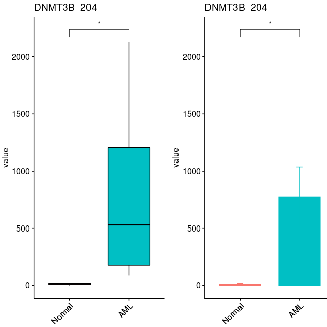

# Step3. The quantification of transcripts by stringtie

To quantify the expression levels of each isoform/transcript in bulk RNA-seq data, `RSEM` and `stringtie` were the most popular tools to used. No matter which tool you used finally , the basic `.bam` files generated from `step1` would be used in this part.

Here, we show the detail codes to process this `.bam` files generated from [Step1](step1.md),  aligned with GRCh38 (you might change the `.gtf` files to your reference)

~~~shell
#here, we need to assign the pathways of tools, refrence and output files 
STRINGTIE=/mnt/data/user_data/xiangyu/programme/stringtie-1.3.4d.Linux_x86_64/stringtie
INPUT_BAM_path=/mnt/data/user_data/xiangyu/workshop/RNAseq/RNAseq_70_ZJN_human_AML_SP_20201207_11samples/GRCh38_version
gtf_refrence=/mnt/data/public_data/reference/Homo_sapiens.GRCh38.90.gtf
output_path=./assembly

#And then, we begin our alignment in each sample
cat config.raw1 | while read id ; do 
arr=($id)
sample=${arr[0]}
echo $sample
$STRINGTIE \
$INPUT_BAM_path/$sample.GRCh38.Aligned.sortedByCoord.out.bam \  #input with .bam files generated from STAR
-e \                                                            #only quantify the specific region mentioned in refence 
-B \                                                            #generate the *.ctab files
-p 40 \                                                         #how many cores you plan to use
-G $gtf_refrence \                                              #genome refence, which should be consistent with STAR alignment
-o $output_path/$sample/$sample.GRCh38.gtf ;                    #the name and paths of output files 
done
~~~

The `stringtie` would generate a count file for each sample, if we want to quantify the expression levels of all samples, we need to integrate these data into one matrix. And `stringtie` also provide a script to execute it. One thing you should notice is that, this script should be executed by `python2.7`

~~~shell
python2 ./WORKFLOW_RNAseq/stringtie_extend/prepDE.py -i $output_path
~~~

The tree structure of output files are as following:

~~~shell
.
├── gene_count_matrix.csv
├── N1
│   ├── e2t.ctab
│   ├── e_data.ctab
│   ├── i2t.ctab
│   ├── i_data.ctab
│   ├── N1.GRCh38.gtf
│   └── t_data.ctab
├── N2
│   ├── e2t.ctab
│   ├── e_data.ctab
│   ├── i2t.ctab
│   ├── i_data.ctab
│   ├── N2.GRCh38.gtf
│   └── t_data.ctab
├── N3
│   ├── e2t.ctab
│   ├── e_data.ctab
│   ├── i2t.ctab
│   ├── i_data.ctab
│   ├── N3.GRCh38.gtf
│   └── t_data.ctab
├── P1
│   ├── e2t.ctab
│   ├── e_data.ctab
│   ├── i2t.ctab
│   ├── i_data.ctab
│   ├── P1.GRCh38.gtf
│   └── t_data.ctab
├── P2
│   ├── e2t.ctab
│   ├── e_data.ctab
│   ├── i2t.ctab
│   ├── i_data.ctab
│   ├── P2.GRCh38.gtf
│   └── t_data.ctab
├── P3
│   ├── e2t.ctab
│   ├── e_data.ctab
│   ├── i2t.ctab
│   ├── i_data.ctab
│   ├── P3.GRCh38.gtf
│   └── t_data.ctab
├── P4
│   ├── e2t.ctab
│   ├── e_data.ctab
│   ├── i2t.ctab
│   ├── i_data.ctab
│   ├── P4.GRCh38.gtf
│   └── t_data.ctab
├── P5
│   ├── e2t.ctab
│   ├── e_data.ctab
│   ├── i2t.ctab
│   ├── i_data.ctab
│   ├── P5.GRCh38.gtf
│   └── t_data.ctab
├── P6
│   ├── e2t.ctab
│   ├── e_data.ctab
│   ├── i2t.ctab
│   ├── i_data.ctab
│   ├── P6.GRCh38.gtf
│   └── t_data.ctab
├── P7
│   ├── e2t.ctab
│   ├── e_data.ctab
│   ├── i2t.ctab
│   ├── i_data.ctab
│   ├── P7.GRCh38.gtf
│   └── t_data.ctab
├── P8
│   ├── e2t.ctab
│   ├── e_data.ctab
│   ├── i2t.ctab
│   ├── i_data.ctab
│   ├── P8.GRCh38.gtf
│   └── t_data.ctab
└── transcript_count_matrix.csv
11 directories, 68 files
~~~

And the `transcript_count_matrix.csv` record all the expression data of transcript in all sample. These data could be used as the input file for `DESeq2` pipeline, to identify the differentiation expression transcript. And you could visualize these data in R, following codes are example:

~~~R
All_Counts <- read.csv("./GRCh38_version/assembly/transcript_count_matrix.csv")
rownames(All_Counts) <- as.character(All_Counts$transcript_id)
iso_id <- c("ENST00000328111","ENST00000353855","ENST00000348286","ENST00000443239","ENST00000456297","ENST00000201963")
names(iso_id) <- c("DNMT3B_202", "DNMT3B_204", "DNMT3B_203", "DNMT3B_205", "DNMT3B_206", "DNMT3B_201")
Sel_genes <- intersect(rownames(All_Counts),iso_id)
Sel_data <- All_Counts[Sel_genes,c("N1","N2","N3","P1","P2","P3","P4","P5","P6","P7","P8")]
rownames(Sel_data) <- names(iso_id)
Sel_data <- reshape2::melt(Sel_data["DNMT3B_204",])
Sel_data$group <- c("Normal","Normal","Normal","AML","AML","AML","AML","AML","AML","AML","AML")
Sel_data$group <- factor(Sel_data$group,levels=c("Normal","AML"))
library(ggpubr)
library(Seurat)
library(cowplot)
p1 <- ggboxplot(Sel_data, x = "group", y = "value", fill = "group",
  title=paste0("DNMT3B_204"), legend = "none",outlier.shape = NA) + 
  rotate_x_text(angle = 45)+
 stat_compare_means(comparisons =list(c("Normal","AML")),label = "p.signif", method = "t.test")
p2 <- ggbarplot(Sel_data, x = "group", y = "value",
        add = c("mean_se"),
        color = "group", fill = "group", alpha = 1,title="DNMT3B_204")+ NoLegend()+
rotate_x_text(angle = 45)+
 stat_compare_means(comparisons =list(c("Normal","AML")),label = "p.signif", method = "t.test")
plot_grid(p1,p2)

~~~

