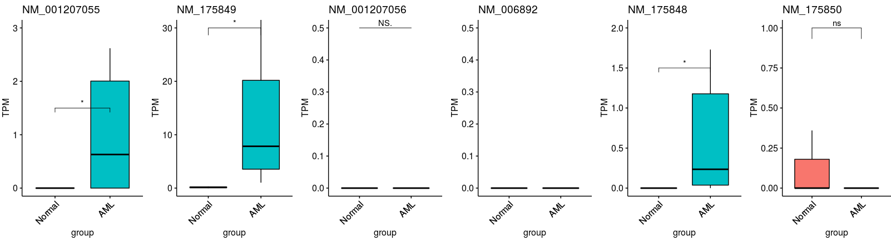

# Step4. The quantification of transcripts by RSEM

To quantify the expression levels of each isoform/transcript in bulk RNA-seq data by`RSEM`, the `*.Aligned.toTranscriptome.out.bam` files had been generated by `STAR` from `step1`.Here, we would show the detail codes to process this `.Aligned.toTranscriptome.out.bam` files to quantify the expression levels off each isoform.

~~~shell
#here, we need to assign the pathways of tools, refrence and output files 
RSEM_psth=/mnt/data/user_data/xiangyu/programme/RSEM-master
rsem-prepare-reference --gtf /mnt/data/public_data/reference/Homo_sapiens/UCSC/hg19/Annotation/Genes/genes.gtf \
/mnt/data/public_data/reference/Homo_sapiens/UCSC/hg19/Sequence/WholeGenomeFasta/genome.fa \
/mnt/data/public_data/reference/Homo_sapiens/UCSC/hg19/rsem_hg19_index/rsem_hg19_index

#here, we need to assign the pathways of tools, refrence and output files 
cat config.raw1  |while read id;
do echo $id
arr=($id)
sample=${arr[0]}
echo $sample
rsem-calculate-expression --paired-end --no-bam-output --alignments -p 50 \
-q /mnt/data/user_data/xiangyu/workshop/RNAseq/RNAseq_70_ZJN_human_AML_SP_20201207_11samples/sortedByCoord.out.bam/new_STAR_res/$sample.Aligned.toTranscriptome.out.bam \
/mnt/data/public_data/reference/Homo_sapiens/UCSC/hg19/rsem_hg19_index/rsem_hg19_index \
/mnt/data/user_data/xiangyu/workshop/RNAseq/RNAseq_70_ZJN_human_AML_SP_20201207_11samples/sortedByCoord.out.bam/new_STAR_res/rsem_res/$sample ;
done
~~~

The tree structure of output files are as following:

~~~shell
tree -lh
.
├── [1.5M]  N1.genes.results
├── [2.6M]  N1.isoforms.results
├── [4.0K]  N1.stat
│   ├── [ 480]  N1.cnt
│   ├── [135K]  N1.model
│   └── [1.4M]  N1.theta
├── [1.5M]  N2.genes.results
├── [2.6M]  N2.isoforms.results
├── [4.0K]  N2.stat
│   ├── [ 454]  N2.cnt
│   ├── [136K]  N2.model
│   └── [1.3M]  N2.theta
├── [1.5M]  N3.genes.results
├── [2.6M]  N3.isoforms.results
├── [4.0K]  N3.stat
│   ├── [ 311]  N3.cnt
│   ├── [135K]  N3.model
│   └── [1.3M]  N3.theta
├── [1.5M]  P1.genes.results
├── [2.6M]  P1.isoforms.results
├── [4.0K]  P1.stat
│   ├── [ 463]  P1.cnt
│   ├── [135K]  P1.model
│   └── [1.3M]  P1.theta
├── [1.5M]  P2.genes.results
├── [2.6M]  P2.isoforms.results
├── [4.0K]  P2.stat
│   ├── [ 459]  P2.cnt
│   ├── [137K]  P2.model
│   └── [1.4M]  P2.theta
├── [1.5M]  P3.genes.results
├── [2.6M]  P3.isoforms.results
├── [4.0K]  P3.stat
│   ├── [ 468]  P3.cnt
│   ├── [137K]  P3.model
│   └── [1.4M]  P3.theta
├── [1.5M]  P4.genes.results
├── [2.6M]  P4.isoforms.results
├── [4.0K]  P4.stat
│   ├── [ 314]  P4.cnt
│   ├── [137K]  P4.model
│   └── [1.4M]  P4.theta
├── [1.5M]  P5.genes.results
├── [2.6M]  P5.isoforms.results
├── [4.0K]  P5.stat
│   ├── [ 318]  P5.cnt
│   ├── [136K]  P5.model
│   └── [1.4M]  P5.theta
├── [1.5M]  P6.genes.results
├── [2.6M]  P6.isoforms.results
├── [4.0K]  P6.stat
│   ├── [ 444]  P6.cnt
│   ├── [137K]  P6.model
│   └── [1.4M]  P6.theta
├── [1.5M]  P7.genes.results
├── [2.6M]  P7.isoforms.results
├── [4.0K]  P7.stat
│   ├── [ 447]  P7.cnt
│   ├── [137K]  P7.model
│   └── [1.4M]  P7.theta
├── [1.5M]  P8.genes.results
├── [2.6M]  P8.isoforms.results
└── [4.0K]  P8.stat
    ├── [ 313]  P8.cnt
    ├── [136K]  P8.model
    └── [1.4M]  P8.theta

11 directories, 55 files
~~~

The `*.isoforms.results` files record all the expression data of transcripts in each sample. And the `*.genes.results` files record all the expression data of genes in each sample. These data could be used as the input file for `DESeq2` pipeline, to identify the differentiation expression transcript. And you could visualize these data in R, following codes are example:

~~~R
files <- list.files(path = "/mnt/data/user_data/xiangyu/workshop/RNAseq/RNAseq_70_ZJN_human_AML_SP_20201207_11samples/sortedByCoord.out.bam/new_STAR_res/rsem_res", pattern = "isoforms.results$", full.names = TRUE)
names(files) <- gsub(".isoforms.results","",basename(files))
All_iso_data_ <- lapply(1:length(files),function(x) {
	tmp <- read.table(files[x],sep="\t",header=TRUE)
	tmp$sample <- names(files)[x]
	return(tmp)
	})
All_iso_data <- do.call(rbind,All_iso_data_)
DNMT3B_ISO <- subset(All_iso_data,gene_id=="DNMT3B")

iso_id <- c("NM_001207055","NM_175849","NM_001207056","NM_006892","NM_175848","NM_175850")
names(iso_id) <- c("SK", "SK", "SK", "NonSK", "NonSK", "NonSK")
Sel_data <- DNMT3B_ISO
Sel_data$group <- ifelse(Sel_data$sample=="N1" | Sel_data$sample=="N2" | Sel_data$sample=="N3","Normal","AML")
Sel_data$group <- factor(Sel_data$group,levels=c("Normal","AML"))
library(ggpubr)
library(cowplot)
p1 <- ggboxplot(subset(Sel_data,transcript_id=="NM_001207055"), x = "group", y = "TPM", fill = "group",
  title=paste0("NM_001207055"), legend = "none",outlier.shape = NA,ylim=c(0,3)) + 
  rotate_x_text(angle = 45)+
 stat_compare_means(comparisons =list(c("Normal","AML")),label = "p.signif", method = "t.test",label.y=c(1.5))
p2 <- ggboxplot(subset(Sel_data,transcript_id=="NM_175849"), x = "group", y = "TPM", fill = "group",
  title=paste0("NM_175849"), legend = "none",outlier.shape = NA,ylim=c(0,30)) + 
  rotate_x_text(angle = 45)+
 stat_compare_means(comparisons =list(c("Normal","AML")),label = "p.signif", method = "t.test",label.y=c(30))
p3 <- ggboxplot(subset(Sel_data,transcript_id=="NM_001207056"), x = "group", y = "TPM", fill = "group",
  title=paste0("NM_001207056"), legend = "none",outlier.shape = NA,ylim=c(0,0.5)) + 
  rotate_x_text(angle = 45)+
 stat_compare_means(comparisons =list(c("Normal","AML")),label = "p.signif", method = "t.test",label.y=c(0.5))
p4 <- ggboxplot(subset(Sel_data,transcript_id=="NM_006892"), x = "group", y = "TPM", fill = "group",
  title=paste0("NM_006892"), legend = "none",outlier.shape = NA,ylim=c(0,0.5)) + 
  rotate_x_text(angle = 45)+
 stat_compare_means(comparisons =list(c("Normal","AML")),label = "p.signif", method = "t.test",label.y=c(2))
p5 <- ggboxplot(subset(Sel_data,transcript_id=="NM_175848"), x = "group", y = "TPM", fill = "group",
  title=paste0("NM_175848"), legend = "none",outlier.shape = NA,ylim=c(0,2)) + 
  rotate_x_text(angle = 45)+
 stat_compare_means(comparisons =list(c("Normal","AML")),label = "p.signif", method = "t.test",label.y=c(1.5))
p6 <- ggboxplot(subset(Sel_data,transcript_id=="NM_175850"), x = "group", y = "TPM", fill = "group",
  title=paste0("NM_175850"), legend = "none",outlier.shape = NA,ylim=c(0,1)) + 
  rotate_x_text(angle = 45)+
 stat_compare_means(comparisons =list(c("Normal","AML")),label = "p.signif", method = "t.test",label.y=c(1))
plot_grid(p1,p2,p3,p4,p5,p6,ncol=6)
~~~

